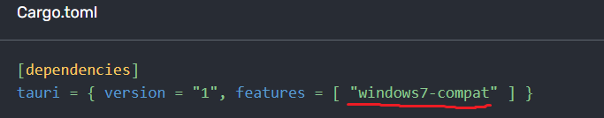
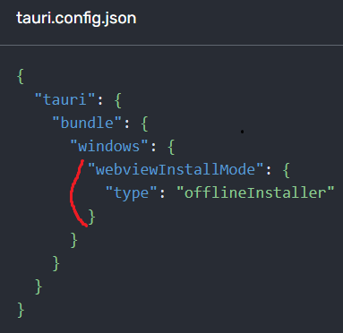
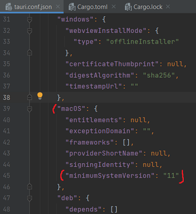

# Crzgames - Launcher

## Tech

<a href="https://www.postgresql.org/docs/" style="margin-left: 25px;">
  
</a> <br />

<a href="https://www.postgresql.org/docs/" style="margin-left: 25px;">
  
</a>
<br /><br />


## Setup for Tauri
1. Install Microsoft Visual Studio 2022 C++ Build Tools
2. Install WebView2 : https://developer.microsoft.com/en-us/microsoft-edge/webview2/#download-section
3. Install Rust : https://www.rust-lang.org/tools/install

## Setup for Vue.js

```bash
# npm
# Install Node.js and npm
npm install -g npm
```

```bash
# npm
# Install dependances
npm install
```

<br /><br />


## Updating Dependencies
Install a global package, to update major/minor versions of available packages npm : 
```bash
# npm
npm install -g npm-check-updates 
```

Pour voir mise à jour des packages disponible de npm, exécutez ce qui suit à la racine :
```bash
ncu
```

Updating Dependencies Vue.js/Tauri, pour mettre à jour les dépendances npm, exécutez ce qui suit à la racine :
```bash
ncu --upgrade
npm install
```

<br />

Updating Rust :
```bash
rustup update
```

<br />

Updating Dependencies Rust/Tauri, pour mettre à jour les dépendances Cargo, exécutez ce qui suit dans le dossier 'src-tauri' :
```bash
cargo update
```

<br /><br />

## Development Server
Start the development server on http://127.0.0.1:1420/

Server type : Desktop (.exe)
```bash
npm run tauri dev
```

Server type : WebApp
```bash
npm run dev
```

<br /><br />

## Production

### Install for production - Windows / macOS / Linux :
Par défaut, Rust installe uniquement les chaînes d'outils pour la cible de votre machine. <br />
Vous devez donc d'abord installer la chaîne d'outils pour le system souhaiter. <br /><br />
Exemple pour Windows 32 bits :
```bash
rustup target add i686-pc-windows-msvc
``` 

Lister les targets déjà installer :
```bash
rustup target list
``` 

Targets disponible : https://doc.rust-lang.org/nightly/rustc/platform-support.html

<br />

### Pour build un système qui est le même que notre machine il faudra utiliser :
```bash
npm run tauri build
```

<br />

### Après avoir build, récupérer les binaires et/ou le programme d'installation pour le système d'exploitation ciblé :

Cette commande intègre vos ressources Web dans un seul binaire avec votre code Rust. <br />
Le binaire lui-même sera situé dans : <br />
```bash
src-tauri/target/release/[app name]
```
Et les programmes d'installation seront situés dans :
```bash
src-tauri/target/release/bundle/
```
<br />

### Build - Windows - .msi :
<span style="color: red;">IMPORTANT</span> : Veuillez noter que les installateurs de .msi ne peuvent être créés que sous Windows car la compilation croisée ne fonctionne pas encore.
<br />

<span style="color: red;">IMPORTANT (2)</span> : Windows 10/11 sont compatible nativement, mais en-dessous de Windows 10 il n'y as pas WebView2 installer par défault. <br />
Il faudra le packager dans l'installeur .msi pour que ce sois compatible à partir de Windows7 et +.

Dossier src-tauri : <br />




64-bit Windows (Windows 7+) :
```bash
npm run tauri build -- --target x86_64-pc-windows-msvc
```

32-bit Windows (Windows 7+) :
```bash
npm run tauri build -- --target i686-pc-windows-msvc
```
<br />

### Build - Linux - .deb / .appimage :
<span style="color: red;">IMPORTANT</span> : Veuillez noter que les paquets .deb / .appimage ne peuvent être créés que sur Linux car la compilation croisée ne fonctionne pas encore.
<br /><br />

ARM64 Linux (kernel 4.1, glibc 2.17+) :
```bash
npm run tauri build -- --target aarch64-unknown-linux-gnu	
```

32-bit Linux (kernel 3.2+, glibc 2.17+) :
```bash
npm run tauri build -- --target i686-unknown-linux-gnu	
```

64-bit Linux (kernel 3.2+, glibc 2.17+)  :
```bash
npm run tauri build -- --target x86_64-unknown-linux-gnu
```
<br />

### Build - macOS (11.0 minimum pour tous) - .app / .dmg :

<span style="color: red;">IMPORTANT</span> : Veuillez noter que les bundles .app et .dmg ne peuvent être créés que sur macOS car la compilation croisée ne fonctionne pas encore. <br />

<span style="color: red;">IMPORTANT (2)</span> : Compiler un .app pour plus de faciliter pour les utilisateurs. Une application .app est similaire à un fichier .exe sur Windows. <br />

<span style="color: red;">IMPORTANT (3)</span> : La version minimale du système d'exploitation nécessaire pour qu'une application Tauri puisse fonctionner sur macOS est 10.13. Si vous avez besoin du support pour les nouvelles API macOS comme window.print qui n'est pris en charge que depuis la version macOS 11. <br />

Dossier src-tauri : <br />

<br /><br />

ARM64 macOS (11.0+, Big Sur+) :
produit un binaire macOS pour les machines Apple en silicium.
```bash
npm run tauri build -- --target aarch64-apple-darwin
```

64-bit macOS (10.7+, Lion+) :
produit un binaire macOS pour les machines Apple basé sur Intel.
```bash
npm run tauri build -- --target x86_64-apple-darwin
```

ARM64/64-bit macOS (11.0+, Big Sur+ / 10.7+, Lion+) :
produit un binaire macOS universel qui s'exécute à la fois sur le silicium Apple et sur les Mac à processeur Intel.
```bash
npm run tauri build -- --target universal-apple-darwin
```

Checkout the [deployment documentation](https://tauri.app/v1/guides/building/) for more information.

<br /><br />

## Infos for dependances / environment

It shows a concise list of information about the environment, Rust, Node.js and their versions as well as some relevant configurations.

```bash
npm run tauri info
```
